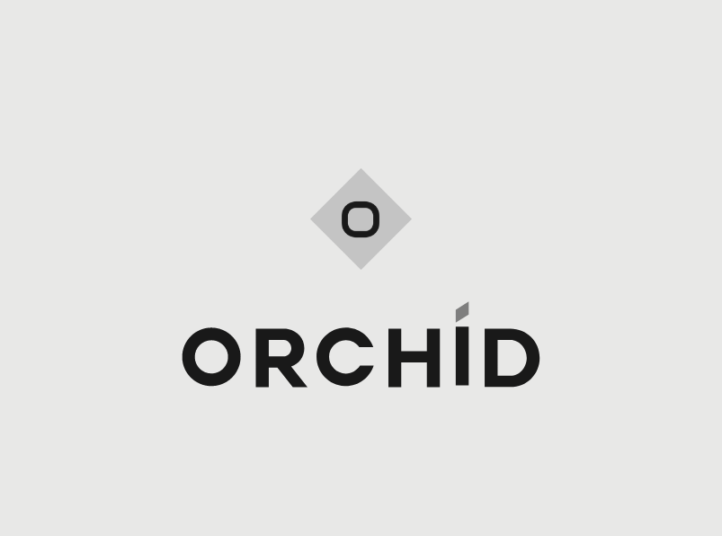

# Orchid Linux 

Orchid is a modern and cute Gentoo-based OS for desktop, laptop and flowers.

The philosophy behind this project is to purpose an advanced Gentoo pure system, personnalized by me with some tweaks and flowers.
Currently, the project isn't available right now, because i'm still working on it and it isn't ready.

There is some specifics things to know about Orchid :

- Based on Gentoo and 100% compatible.
- For advanced users, even if the installation will be easier than Gentoo himself.
- Use my specific mirror, with auto import from Gentoo tree every 4 hours.
- no-gui installation, I wanted to keep staged install process.
- All Gentoo packages is available.
- Kernel is gentoo-kernel and always up-to-date. Follow current kernel (5.16.11 actually).
- New emerge alt : blossom.
- Eix by default.
- All X11, KDE, Firefox installed.
- No systemd, no flatpak and no snap.
- Compiling powered.

Stages and installation guide will be availaible soon.