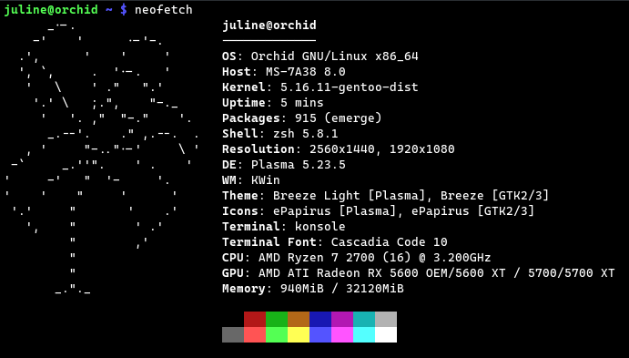

# Orchid Linux 

Orchid is a modern and cute Gentoo-based for desktop, laptop and flowers.

The philosophy behind this project is to purpose an advanced Gentoo pure system, personnalized by me with some tweaks.
Currently, the project isn't available right now, because i'm still working on it and it isn't ready.

There is some specifics things to know about Orchid :

- We not define as an OS, for now, it will be an enhanced stage 3 with profile plasma. 
  A script is needed to finish and apply tweaks, setup kernel and installations of X11, KDE and optionnal others besause it can't be included in stage3 (for moment)
  So basically, it's a Gentoo transformation.
- Based on Gentoo and 100% compatible.
- For advanced users, even if the installation will be easier and shorter than Gentoo itself.
- Use my specific mirror, with auto import from Gentoo tree every 4 hours.
- No-gui installation, I wanted to keep staged install process.
- All Gentoo packages is available.
- Kernel is gentoo-kernel and always up-to-date. Follow current kernel (5.16.11 actually).
- New emerge alt : blossom.
- EIX by default.
- All X11, KDE, Firefox installed (a lot of time saved).
- No systemd and no snap.
- Flatpak is better fonctionnal than overlays, in most cases.
- Still source-based.

Stages and installation guide will be availaible soon.
